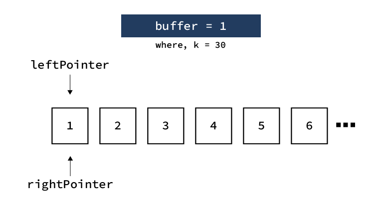

# 2019-11-21

### 개인별 문제풀이 기록하기 - 신성환(github.com/blueStragglr)

---

### Subarray product less than K

(https://leetcode.com/problems/subarray-product-less-than-k/)


#### 문제 요약:

해당 문제는 주어진 Integer List의 contiguous subset 중, 곱한 값이 target value 미만인 subset을 모두 찾는 문제이다. 

> Input: [1,2,3,4,5,6] 30
>
> 위와 같은 input이 주어졌을 때, 모두 곱한 값이 30 미만인 contiguous subarray는 다음과 같다.
>
> ​	[1], [1,2], [1,2,3], [1,2,3,4], [2], [2,3], [2,3,4], [3],[3,4], [4], [4,5], [5], [6]
>
> 따라서 이 경우, 위 subarray 갯수인 13을 return한다.
>
> output: 13

#### 풀이 해설:

#### Solution 1. Brute Force (Time Exceed)

##### Time: O(n^3), Space: O(1)

```python
class Solution:
    def numSubarrayProductLessThanK(self, nums: List[int], k: int) -> int:

        answer = 0        
        for i in range(len(nums)):
            for j in range(i+1, len(nums)+1):
                if(totalMultiply(nums[i:j])<k):
                    answer+=1
        return answer
    
def totalMultiply(nums: List[int]) -> int:
    answer = 1
    for number in nums:
        answer *= number
    return answer 


```

subarray의 모든 곱을  return하는 함수를 만들어, 존재가능한 모든 contiguous subarry를 확인하여 갯수를 확인하였으나 시간 초과가 발생하였습니다. 


#### Solution 2. Dynamic Programming ~ Two Pointer Approach I (Time Limit Exceed)

##### Time: O(n^2), Space: O(1)

```python
class Solution:
    def numSubarrayProductLessThanK(self, nums: List[int], k: int) -> int:
        
        answer = 0;
        for i in range(len(nums)):
            if nums[i] > k:
                continue
                
            pointer = i                
            buffer = nums[i]
            while buffer < k:
                pointer += 1
                if pointer == len(nums):
                    break;
                buffer *= nums[pointer]
            
            if i == len(nums):
                if buffer < k:
                    answer += pointer - (i - 1)
            else:
                answer += pointer - i
            
            buffer = 1
        
        return answer

```

모든 subarray에 대해 계산을 수행하는 것이 아니라, pointer 두 개를 이용하여 subarray의 갯수를 뭉텅이로 셌습니다. 그때그때 모든 subarray의 곱을 계산하는 것이 아니라, array의 한 요소에서 출발하여 곱한 값이 target을 초과하는 경우까지 진행한 다음 해당 array 내의 contiguous subarry 갯수만을 더하는 방식을 사용하였습니다.

Order는 n^1만큼 줄어들었지만 여전히 time limit exceed가 발생하였습니다. 


### Solution 3. Dynamic Programming ~ Two Pointer Search II (Successed!)

#### Time: O(n), Space: O(1)

```python
class Solution:
    def numSubarrayProductLessThanK(self, nums: List[int], k: int) -> int:
        
        answer = 0
        leftPointer = 0
        rightPointer = 0
        buffer = 1
        while leftPointer != len(nums):
            
            # buffer가 k보다 커질 때 까지 rightPointer를 옮기며 곱함
            while buffer < k:
                # buffer를 넘지 않고 마지막에 도달한 경우, 루프를 종료
                if (rightPointer == len(nums)):
                    break;
                buffer *= nums[rightPointer]
                rightPointer += 1
            
            
            # 마지막에 buffer를 초과시킨 값을 나눠서 다시 없앰
            # 단, rightPointer가 index의 마지막에 도달하였으며, buffer를 초과하지 않은 경우에는 그러지 않음. 
            if(buffer >= k):
                # 포인터도 다시 한칸 앞으로 당김
                rightPointer -= 1
                buffer /= nums[rightPointer]
            
            
            # 단일 값이 k보다 같거나 커서 while 루프를 돌지 못한 경우에 대한 예외처리 
            # i.e. input: [1,1,1], 0
            if(rightPointer < leftPointer):
                leftPointer += 1
                rightPointer = leftPointer
                continue
                
            # leftPointer의 값을 포함하는, contiguous subarray의 갯수를 셈
            answer += rightPointer - leftPointer
            
            # leftPointer를 한칸 오른쪽으로 이동
            buffer /= nums[leftPointer]
            leftPointer += 1
        
        return answer
      
```

이미 곱한 것들을 다시 곱하는 order를 줄이기 위해서 곱한 값을 buffer에 유지하며 linear하게 fragment를 탐색하였습니다. 아래의 그림을 보면 이해하기가 조금 더 쉬울겁니다!



위 그림과 같이 두 개의 pointer를 유지하며, 현재까지 탐색한 fragment의 값이 target을 초과한 경우 마지막 값을 제외한, *leftPointer 위치의 요소를 포함하는* (중복되는 요소를 제거하기 위함입니다.) subarray를 추가합니다. 그 다음 leftPointer 를 이동시켜 같은 동작을 수행하며, leftPointer가 list의 마지막에 도달할 때 까지 반복합니다.

rightPointer가 마지막에 도달하였으나 target보다 곱한 값이 작을 때에는 leftPointer만 이동하며 값을 추가하게 되며, 특정 단일값이 buffer보다 큰 경우에는 해당 값을 뛰어넘습니다. 


---

### Delete and Earn

https://leetcode.com/problems/delete-and-earn/

#### 문제 요약:

해당 문제는 Integer Array에서 특수한 규칙(특정 숫자를 선택하는 경우, 인접하는 숫자를 모두 버려야 함 -- 즉, 3을 사용하고자 한다면 2와 4를 함께 소모하여야 함) 하에서 숫자를 뽑아 최댓값을 얻는 문제이다. input에는 같은 숫자가 여러 개 포함될 수 있으며, 같은 값은 모두 사용할 수 있다. 즉, 4가 두 개 있다면 4를 두 개 뽑아 8로써 사용할 수 있다. 

> Input: [2,3,4,4,5]
>
> 2를 선택하고 (3 삭제), 4 두 개를 선택하여(5 삭제) 10을 만드는 경우가 가장 큰 총합을 얻을 수 있는 경우이다. 
>
> output: 10

#### 풀이 해설:

#### Solution 1. Greedy Algorithm

##### Time: O(n), Space: O(1)

```python
class Solution:
    def deleteAndEarn(self, nums: List[int]) -> int:
        if not nums:
            return 0
          
        # Python Counter ~ 특정 element가 몇 개 있는지 세어 hashmap 형태로 반환
        c = collections.Counter(nums)
        # Counter의 값을 tuple array 형태로 바꾼 뒤, sort하여 저장 
        sortedNums = sorted([(i,v) for i,v in c.items()])
        # 같은 길이의 0으로 초기화된 Array 생성
        # 특정 index까지의 Greedy한 탐색 결과를 저장
        sordtedList = [0 for _ in range(len(sortedNums))]
        # 첫 index를 탐색하여 얻을 수 있는 최대값을 저장
        sordtedList[0] = sortedNums[0][1] * sortedNums[0][0]
        
        for i in range(1, len(sortedNums)):
          	# 우선, i번째 index의 값을 취했을때 얻을 수 있는 값을 저장.  
            sordtedList[i] = sortedNums[i][1] * sortedNums[i][0]
            # 만일 직전 요소가 인접 요소여서 값을 포기해야 하는 경우
            if sortedNums[i][0] == sortedNums[i - 1][0] + 1:
              	# 해당 경우가 두 번째 값이 아니라면 2칸 앞의 값을 추가함. 즉, 인접값을 포기한 경우의 값을 저장.
                if i != 1:
                    sordtedList[i] += sordtedList[i - 2]
                # 인접값을 사용하지 않는 경우와 사용하는 경우 중 최댓값을 선택하여 저장.
                # 해당 값은 [0:i] slice에서 얻을 수 있는 최댓값을 greedy하게 저장하게 됨. 
                sordtedList[i] = max(sordtedList[i], sordtedList[i - 1])
            else:
              	# 인접값이 아니라면 사용하는 것이 이득이므로 그냥 추가. 
                sordtedList[i] += sordtedList[i - 1]
        return sordtedList[-1]
      
```

Linear하게 탐색하며 특정 요소를 사용할것인지 말것인지를 greedy하게 탐색합니다. 특정 요소의 사용 여부에 의해 영향을 받는 선택은 직전 요소(중에서도 값이 1만 차이나는 경우) 밖에 없으므로, linear 하게 greedy search를 수행할 수 있습니다. 


